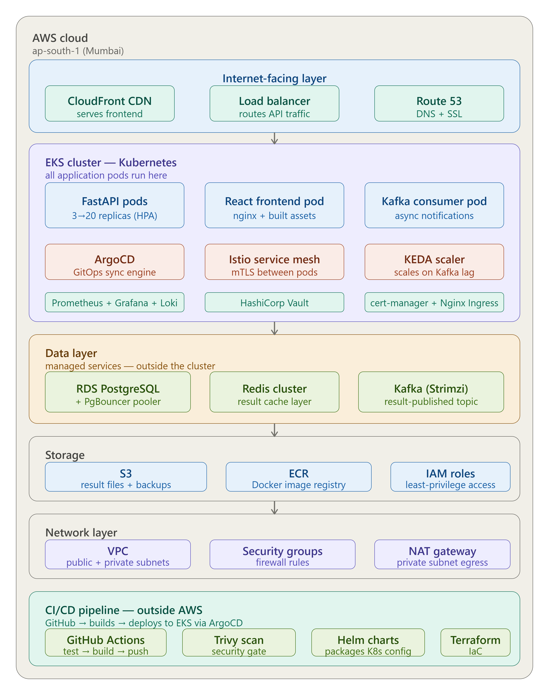
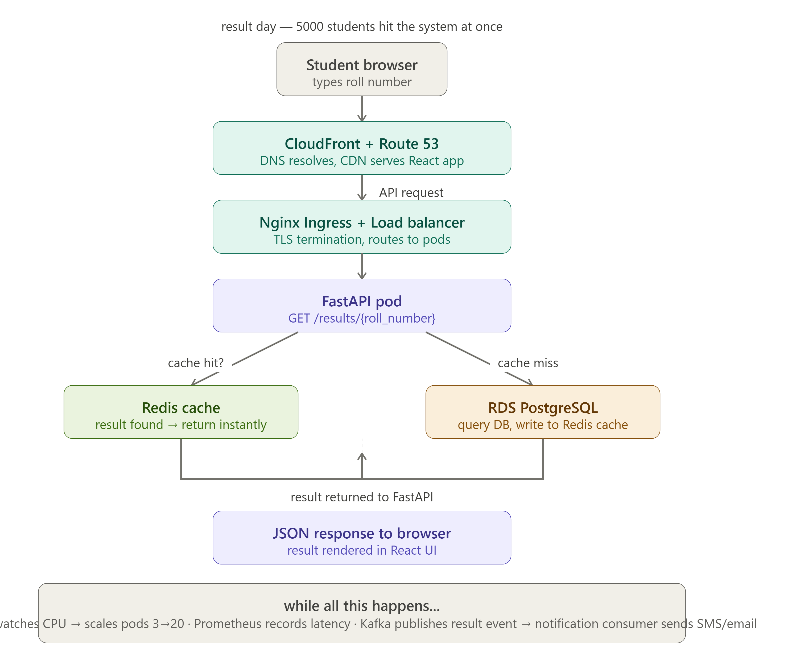

# crms

## Open-Source
The design is open-source and college-agnostic, any institution can deploy CRMS and configure it for their own semester structure, regulations, and branding.

<div align="center">



# CRMS — College Result Management System

[](https://github.com/crms-devops/crms/actions)
[](LICENSE)
[](https://github.com/crms-devops/crms/tags)

</div>

---

## The Problem

Every semester result day, college result portals crash when thousands of
students access them simultaneously. SIET's current portal at siet.ac.in
becomes unavailable for hours.

## Our Solution

CRMS is a production-grade, open-source result portal built by students
of Sri Shakthi Institute of Engineering and Technology. It handles 5000+
concurrent users with Kubernetes autoscaling, Redis caching, and full
observability.

Built to handle 5000+ concurrent users with:
- FastAPI backend with async support
- Redis caching layer(1 DB query serves thousands)
- Kubernetes auto-scaling(pods scale with traffic)
- Full observability(Prometheus + Grafana)
- AWS cloud support

Leveraging K8s auto-scaling, redis caching, AWS infrastructure, automated security scanning, CI/CD and real-time observability, CRMS is highly available during result-day traffic.


---

## Live Demo

| Component | URL |
|-----------|-----|
| Result Portal | Deploy with `terraform apply` + `kubectl apply` |
| API Docs | `http://localhost:8000/docs` |
| Grafana Dashboard | `http://localhost:3000` |

---

## Verified Performance

| Metric | Result |
|--------|--------|
| Concurrent users tested | 100 VUs |
| Total requests | 24,841 |
| Error rate | **0.00%** |
| p99 latency | **58.94ms** |
| Throughput | 137 req/sec |
| Security CVEs caught | CVE-2024-33663 (CRITICAL) |

---

## Tech Stack

| Layer | Technology |
|-------|-----------|
| Backend API | FastAPI (Python) + SQLAlchemy |
| Frontend | React 19 + TypeScript + Vite |
| Database | PostgreSQL 16 + Alembic migrations |
| Cache | Redis |
| Containers | Docker + docker-compose |
| CI/CD | GitHub Actions (pytest + ESLint + Trivy) |
| Cloud | AWS (EKS + RDS + S3 + ECR) |
| IaC | Terraform + S3 remote state |
| Orchestration | Kubernetes + Helm + HPA |
| GitOps | ArgoCD (auto-sync from GitHub) |
| Observability | Prometheus + Grafana + Loki |
| Events | Kafka + KEDA (event-driven scaling) |
| Load Testing | k6 |
| Security | Trivy (caught CVE-2024-33663) |

---

## Architecture



### Request flow on result day
1. 5000 students hit the portal simultaneously
2. CloudFront CDN serves the React frontend
3. Nginx Ingress routes API requests to FastAPI pods
4. FastAPI checks Redis cache first (sub-5ms)
5. Cache miss → PostgreSQL query → cache result
6. HPA scales FastAPI from 2 → 10 pods under load
7. Faculty upload triggers Kafka event → student notifications

---

## Quick Start

### Local development
```bash
docker compose up --build
```
Open `http://localhost` — CRMS portal running in Docker.

### AWS deployment
```bash
cd infra/terraform
terraform init
terraform apply -auto-approve

aws eks update-kubeconfig --name crms-dev --region ap-south-1
kubectl apply -f k8s/base/namespace.yaml
kubectl apply -f k8s/base/
kubectl get service crms-frontend-service -n crms
```

### Run load test
```bash
k6 run k6/load-test.js
```

---

## Project Structure

crms/
├── backend/ FastAPI + SQLAlchemy + Alembic
├── frontend/ React 19 + TypeScript
├── infra/
│ └── terraform/ VPC + EKS + RDS + S3
├── k8s/
│ ├── base/ Kubernetes manifests
│ └── argocd/ GitOps configuration
├── observability/ Prometheus + Grafana
├── k6/ Load test scripts
└── docs/ Architecture, decisions, weekly notes


---

## CI/CD Pipeline

Every push triggers:
1. **pytest** — FastAPI test suite with real PostgreSQL
2. **ESLint** — TypeScript code quality
3. **Docker build** — multi-stage builds
4. **Trivy scan** — container security (BLOCKS on CRITICAL CVEs)

Every merge to main:
- Images pushed to GHCR with SHA tag
- ArgoCD auto-syncs to EKS cluster

---

## Milestones

| Tag | Milestone |
|-----|-----------|
| v0.1.0 | Project structure + DB schema v2 + OpenAPI spec |
| v0.2.0 | FastAPI + React + login 200 OK |
| v0.3.0 | Full result portal working locally |
| v0.4.0 | Docker - full stack containerised |
| v0.5.0 | GitHub Actions CI/CD + CVE-2024-33663 caught |
| v0.6.0 | Terraform VPC on AWS |
| v0.7.0 | S3 remote state |
| v0.8.0 | EKS cluster - kubectl get nodes READY |
| v0.9.0 | CRMS live on Kubernetes with LoadBalancer |
| v0.10.0 | ArgoCD GitOps - Synced from GitHub |
| v0.11.0 | Prometheus + Grafana - cluster dashboards live |
| v0.12.0 | Kafka + KEDA + k6 - 0% error rate |
| v0.13.0 | Alembic auto-migrations on startup |
| v0.15.0 | SIET branded portal - college proposal ready |
| v0.16.0 | Phase 1 complete |

---

## Team

**Jashwanth M** ([@JashwanthMU](https://github.com/JashwanthMU))
**Deepak K** ([@deepaklearneratcbe](https://github.com/deepaklearneratcbe))


---

## Phase 2 — DevSecOps Pipeline (planned)

19-gate security pipeline including:
Gitleaks, Hadolint, Checkov, TerraSecure, Bandit, SonarQube,
Snyk, Syft SBOM, Trivy, OWASP ZAP DAST, OPA, Vault, ArgoCD

See [`docs/decisions/devsecops-pipeline.md`](docs/decisions/devsecops-pipeline.md)

