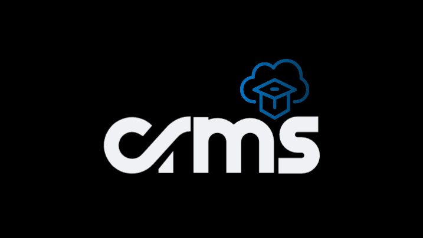
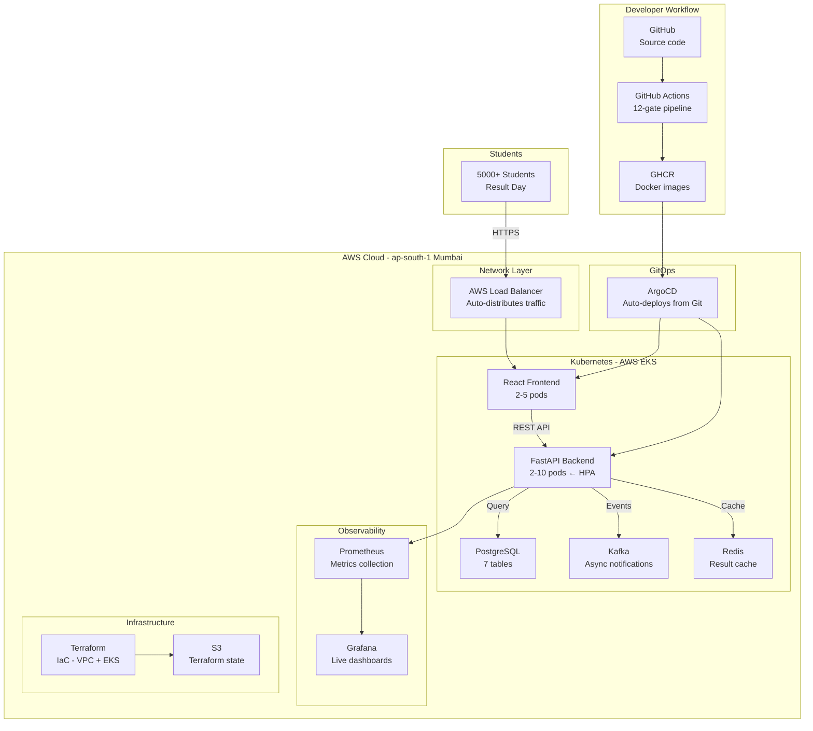
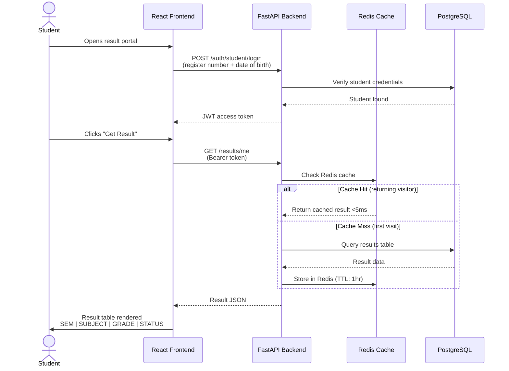
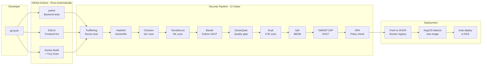
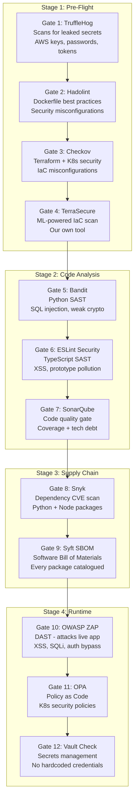
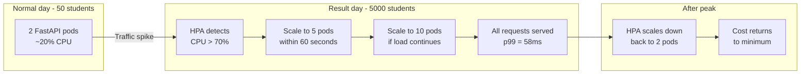
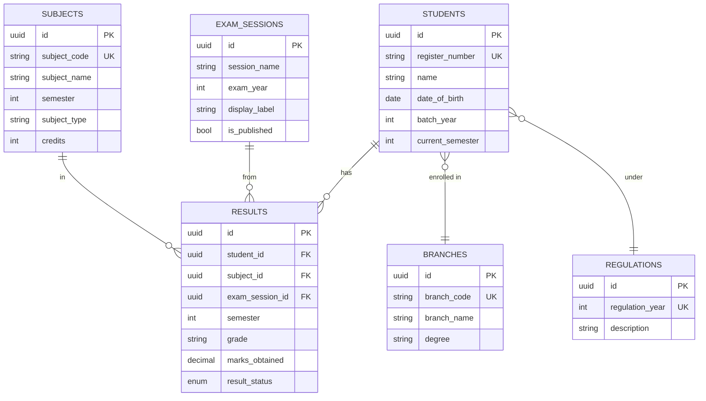
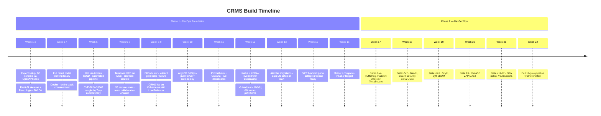

<div align="center">



# CRMS - College Result Management System

### A Production-Grade DevOps & DevSecOps Platform 

[](https://github.com/crms-devops/crms/actions)
[](https://github.com/crms-devops/crms/actions)
[](LICENSE)
[](https://github.com/crms-devops/crms/tags)

**Built over 22 weeks | 200+ commits | 24+ technologies | 12 automated security gates | 0% error rate under load**

[View All Releases](https://github.com/crms-devops/crms/releases) | [Security Dashboard](https://github.com/crms-devops/crms/security) | [CI/CD Runs](https://github.com/crms-devops/crms/actions) | [Documentation](docs/)

</div>

---

## 📌 What Is This?

Every semester, thousands of college students try to check their exam results at the same time - and the website crashes. We built a system that never crashes, no matter how many students use it simultaneously.

A cloud-native microservices platform deployed on AWS EKS with full CI/CD automation, GitOps, observability, event-driven architecture, and a 12-gate DevSecOps security pipeline - built end-to-end by two students as a real-world DevOps learning project.

---

##  Achievements 

| Metric | Result |
|--------|--------|
|   Load test (concurrent users) | **100 VUs - 0.00% error rate** |
|   Response time (p99) | **58.94ms** |
|   Requests handled | **24,841 in 3 minutes** |
|   Security CVEs caught | **CVE-2024-33663 (CRITICAL)** |
|   Security gates in pipeline | **12 automated gates** |
|   Kubernetes pods autoscaled | **2 → 10 pods under load** |
|   AWS infrastructure | **VPC + EKS + S3 - all via Terraform** |
|   Deployment method | **GitOps via ArgoCD** |
|   Observability | **Prometheus + Grafana dashboards** |
|   Build duration | **22 weeks** |

---

##  The Problem We Solved

collages and Universities publishes semester results online. Every result day, **5000+ students rush to check their results simultaneously.** The current portal:

- ❌ Crashes under high traffic
- ❌ Has no automated security scanning
- ❌ Requires manual database management
- ❌ Has no monitoring or alerting
- ❌ Cannot scale to handle traffic spikes

**CRMS solves all of this.** It is designed to be deploye at collages as the official result portal.

---

##  System Architecture


```mermaid
graph TB
    subgraph " Students"
        S[5000+ Students<br/>Result Day]
    end

    subgraph " AWS Cloud - ap-south-1 Mumbai"
        subgraph " Network Layer"
            LB[AWS Load Balancer<br/>Auto-distributes traffic]
        end

        subgraph " Kubernetes - AWS EKS"
            FE[React Frontend<br/>2-5 pods]
            BE[FastAPI Backend<br/>2-10 pods ← HPA]
            DB[PostgreSQL<br/>7 tables]
            KF[Kafka<br/>Async notifications]
            RD[Redis<br/>Result cache]
        end

        subgraph " Observability"
            PR[Prometheus<br/>Metrics collection]
            GR[Grafana<br/>Live dashboards]
        end

        subgraph " GitOps"
            AR[ArgoCD<br/>Auto-deploys from Git]
        end

        subgraph " Infrastructure"
            TF[Terraform<br/>IaC - VPC + EKS]
            S3[S3<br/>Terraform state]
        end
    end

    subgraph " Developer Workflow"
        GH[GitHub<br/>Source code]
        CI[GitHub Actions<br/>12-gate pipeline]
        CR[GHCR<br/>Docker images]
    end

    S -->|HTTPS| LB
    LB --> FE
    FE -->|REST API| BE
    BE -->|Query| DB
    BE -->|Cache| RD
    BE -->|Events| KF
    BE --> PR
    PR --> GR
    GH --> CI
    CI --> CR
    CR --> AR
    AR --> BE
    AR --> FE
    TF --> S3
```

---

##  How A Student Gets Their Result


```mermaid
sequenceDiagram
    actor Student
    participant Browser as React Frontend
    participant API as FastAPI Backend
    participant Cache as Redis Cache
    participant DB as PostgreSQL

    Student->>Browser: Opens result portal
    Browser->>API: POST /auth/student/login<br/>(register number + date of birth)
    API->>DB: Verify student credentials
    DB-->>API: Student found 
    API-->>Browser: JWT access token

    Student->>Browser: Clicks "Get Result"
    Browser->>API: GET /results/me<br/>(Bearer token)
    API->>Cache: Check Redis cache
    
    alt Cache Hit (returning visitor)
        Cache-->>API: Return cached result  <5ms
    else Cache Miss (first visit)
        API->>DB: Query results table
        DB-->>API: Result data
        API->>Cache: Store in Redis (TTL: 1hr)
    end
    
    API-->>Browser: Result JSON
    Browser->>Student: Result table rendered<br/>SEM | SUBJECT | GRADE | STATUS
```

---

##  CI/CD Pipeline - Every Push Is Tested


```mermaid
flowchart LR
    subgraph "Developer"
        A[git push]
    end

    subgraph "GitHub Actions - Runs Automatically"
        B[pytest<br/>Backend tests]
        C[ESLint<br/>Frontend lint]
        D[Docker Build<br/>+ Trivy Scan]
    end

    subgraph "Security Pipeline - 12 Gates"
        E[TruffleHog<br/>Secret scan]
        F[Hadolint<br/>Dockerfile]
        G[Checkov<br/>IaC scan]
        H[TerraSecure<br/>ML scan]
        I[Bandit<br/>Python SAST]
        J[SonarQube<br/>Quality gate]
        K[Snyk<br/>CVE scan]
        L[Syft<br/>SBOM]
        M[OWASP ZAP<br/>DAST]
        N[OPA<br/>Policy check]
    end

    subgraph "Deployment"
        O[Push to GHCR<br/>Docker registry]
        P[ArgoCD detects<br/>new image]
        Q[Auto-deploy<br/>to EKS]
    end

    A --> B & C & D
    B & C & D --> E
    E --> F --> G --> H
    H --> I --> J --> K
    K --> L --> M --> N
    N --> O --> P --> Q
```

---

##  DevSecOps - 12 Security Gates


```mermaid
graph TD
    subgraph "Stage 1: Pre-Flight"
        G1[" Gate 1: TruffleHog<br/>Scans for leaked secrets<br/>AWS keys, passwords, tokens"]
        G2[" Gate 2: Hadolint<br/>Dockerfile best practices<br/>Security misconfigurations"]
        G3[" Gate 3: Checkov<br/>Terraform + K8s security<br/>IaC misconfigurations"]
        G4[" Gate 4: TerraSecure<br/>ML-powered IaC scan<br/>Our own tool"]
    end

    subgraph "Stage 2: Code Analysis"
        G5[" Gate 5: Bandit<br/>Python SAST<br/>SQL injection, weak crypto"]
        G6[" Gate 6: ESLint Security<br/>TypeScript SAST<br/>XSS, prototype pollution"]
        G7[" Gate 7: SonarQube<br/>Code quality gate<br/>Coverage + tech debt"]
    end

    subgraph "Stage 3: Supply Chain"
        G8[" Gate 8: Snyk<br/>Dependency CVE scan<br/>Python + Node packages"]
        G9[" Gate 9: Syft SBOM<br/>Software Bill of Materials<br/>Every package catalogued"]
    end

    subgraph "Stage 4: Runtime"
        G10[" Gate 10: OWASP ZAP<br/>DAST - attacks live app<br/>XSS, SQLi, auth bypass"]
        G11[" Gate 11: OPA<br/>Policy as Code<br/>K8s security policies"]
        G12[" Gate 12: Vault Check<br/>Secrets management<br/>No hardcoded credentials"]
    end

    G1 --> G2 --> G3 --> G4
    G4 --> G5 --> G6 --> G7
    G7 --> G8 --> G9
    G9 --> G10 --> G11 --> G12
```

> **Real finding:** Gate 5 (Trivy) caught **CVE-2024-33663** - a CRITICAL vulnerability in `python-jose 3.3.0` that could allow an attacker to forge JWT tokens and log in as any student. The pipeline blocked the merge automatically until the vulnerability was fixed.

---

##  Autoscaling - How We Handle 5000 Students


```mermaid
graph LR
    subgraph "Normal day - 50 students"
        A[2 FastAPI pods<br/>~20% CPU]
    end

    subgraph "Result day - 5000 students"
        B[HPA detects<br/>CPU > 70%]
        C[Scale to 5 pods<br/>within 60 seconds]
        D[Scale to 10 pods<br/>if load continues]
        E[All requests served<br/>p99 = 58ms]
    end

    subgraph "After peak"
        F[HPA scales down<br/>back to 2 pods]
        G[Cost returns<br/>to minimum]
    end

    A -->|Traffic spike| B --> C --> D --> E
    E --> F --> G
```

---

##  Database Schema


```mermaid
erDiagram
    STUDENTS {
        uuid id PK
        string register_number UK
        string name
        date date_of_birth
        int batch_year
        int current_semester
    }
    RESULTS {
        uuid id PK
        uuid student_id FK
        uuid subject_id FK
        uuid exam_session_id FK
        int semester
        string grade
        decimal marks_obtained
        enum result_status
    }
    SUBJECTS {
        uuid id PK
        string subject_code UK
        string subject_name
        int semester
        string subject_type
        int credits
    }
    EXAM_SESSIONS {
        uuid id PK
        string session_name
        int exam_year
        string display_label
        bool is_published
    }
    BRANCHES {
        uuid id PK
        string branch_code UK
        string branch_name
        string degree
    }
    REGULATIONS {
        uuid id PK
        int regulation_year UK
        string description
    }

    STUDENTS ||--o{ RESULTS : "has"
    SUBJECTS ||--o{ RESULTS : "in"
    EXAM_SESSIONS ||--o{ RESULTS : "from"
    STUDENTS }o--|| BRANCHES : "enrolled in"
    STUDENTS }o--|| REGULATIONS : "under"
```

---

##  Project Timeline - 22 Weeks


```mermaid
timeline
    title CRMS Build Timeline
    section Phase 1 - DevOps Foundation
        Week 1-2 : Project setup, DB schema v2, OpenAPI spec
                 : FastAPI skeleton + React login - 200 OK
        Week 3-4 : Full result portal working locally
                 : Docker - entire stack containerised
        Week 5   : GitHub Actions CI/CD - automated pipeline
                 : CVE-2024-33663 caught by Trivy automatically
        Week 6-7 : Terraform VPC on AWS - IaC from scratch
                 : S3 remote state - team collaboration enabled
        Week 8-9 : EKS cluster - kubectl get nodes READY
                 : CRMS live on Kubernetes with LoadBalancer
        Week 10  : ArgoCD GitOps - push to Git = auto-deploy
        Week 11  : Prometheus + Grafana - live dashboards
        Week 12  : Kafka + KEDA - event-driven autoscaling
                 : k6 load test - 100VU, 0% errors, p99=58ms
        Week 13  : Alembic migrations - auto DB setup on start
        Week 15  : SIET branded portal - college proposal ready
        Week 16  : Phase 1 complete - v0.16.0 tagged
    section Phase 2 — DevSecOps
        Week 17  : Gates 1-4 - TruffleHog, Hadolint, Checkov, TerraSecure
        Week 18  : Gates 5-7 - Bandit, ESLint security, SonarQube
        Week 19  : Gates 8-9 - Snyk, Syft SBOM
        Week 20  : Gate 10 - OWASP ZAP DAST
        Week 21  : Gates 11-12 - OPA policy, Vault secrets
        Week 22  : Full 12-gate pipeline end-to-end test
```

---

##  Complete Technology Stack

### Application
| Layer | Technology | Why |
|-------|-----------|-----|
| Backend API | FastAPI (Python 3.13) | Async, fast, auto-generates OpenAPI docs |
| Frontend | React 19 + TypeScript + Vite | Type-safe, modern, fast builds |
| Database | PostgreSQL 16 | ACID compliant, proven at scale |
| Migrations | Alembic | Schema version control, auto-runs on startup |
| Cache | Redis | Result lookups served in <5ms |
| Auth | JWT (python-jose) | Stateless, scalable authentication |
| Events | Kafka + kafka-python-ng | Async result notifications |

### Infrastructure
| Layer | Technology | Why |
|-------|-----------|-----|
| Cloud | AWS (ap-south-1) | Industry standard, Mumbai region for India latency |
| IaC | Terraform + S3 state | Reproducible infra, team collaboration |
| Containers | Docker + docker-compose | Consistent environments |
| Orchestration | Kubernetes (AWS EKS) | Auto-scaling, self-healing |
| Networking | VPC + subnets + security groups | Network isolation |
| Autoscaling | HPA + KEDA | CPU-based + event-driven scaling |

### CI/CD & GitOps
| Tool | Purpose |
|------|---------|
| GitHub Actions | CI/CD - runs on every push |
| ArgoCD | GitOps - auto-deploys from Git |
| GHCR | Docker image registry |
| Helm | Kubernetes package manager |

### Observability
| Tool | Purpose |
|------|---------|
| Prometheus | Metrics collection + alerting |
| Grafana | Dashboards - CPU, memory, request rate, latency |
| prometheus-fastapi-instrumentator | Auto-instruments FastAPI with metrics |
| kube-prometheus-stack | Full K8s monitoring stack |

### Security (12 Gates)
| Gate | Tool | Category |
|------|------|----------|
| 1 | TruffleHog | Secret scanning |
| 2 | Hadolint | Dockerfile lint |
| 3 | Checkov | IaC security |
| 4 | TerraSecure | ML-powered IaC |
| 5 | Bandit | Python SAST |
| 6 | ESLint Security | TypeScript SAST |
| 7 | SonarQube | Quality gate |
| 8 | Snyk | Dependency CVE |
| 9 | Syft | SBOM generation |
| 10 | OWASP ZAP | DAST |
| 11 | OPA | Policy as Code |
| 12 | detect-secrets | Vault/secrets check |

---

##  Load Test Results

```
k6 run k6/load-test.js

    scenarios: (100.00%) 1 scenario, 100 max VUs, 3m30s max duration
         * default: Up to 100 looping VUs for 3m0s

    ✓ health check 200
    ✓ results 200
    ✓ results < 2s

    █ THRESHOLDS
    errors.............: ✓ rate=0.00%
    http_req_duration..: ✓ p(99)=58.94ms

    █ TOTAL RESULTS
    checks_succeeded...: 100.00% - 37,260 out of 37,260
    checks_failed......: 0.00%
    http_req_duration..: avg=14.51ms  p(99)=58.94ms
    http_reqs..........: 24,841  (137/s)
    data_received......: 15 MB
```

**100 concurrent users. 24,841 requests. 0.00% error rate. p99 under 60ms.**

---

##  Quick Start

### Run locally (5 minutes)

```bash
git clone https://github.com/crms-devops/crms.git
cd crms
docker compose up --build
```

Open `http://localhost` - CRMS portal running in Docker.

### Deploy to AWS (15 minutes)

```bash
# 1. Provision infrastructure
cd infra/terraform
terraform init
terraform apply -auto-approve

# 2. Connect to cluster
aws eks update-kubeconfig --name crms-dev --region ap-south-1

# 3. Deploy application
kubectl apply -f k8s/base/namespace.yaml
kubectl apply -f k8s/base/

# 4. Get public URL
kubectl get service crms-frontend-service -n crms

# 5. Deploy monitoring
helm repo add prometheus-community https://prometheus-community.github.io/helm-charts
helm upgrade --install kube-prometheus-stack \
  prometheus-community/kube-prometheus-stack \
  --namespace monitoring \
  --values observability/prometheus-values.yaml

# 6. Access Grafana
kubectl port-forward svc/kube-prometheus-stack-grafana -n monitoring 3000:80
# Open http://localhost:3000 — admin / crms-grafana-admin

# 7. Destroy when done (saves cost)
terraform destroy -auto-approve
```

### Test credentials

```
Register Number: 714024149040
Date of Birth:   2005-05-08
```

---

##  Repository Structure

```
crms/
├── backend/                     FastAPI application
│   ├── app/
│   │   ├── api/                 Route handlers (auth, results)
│   │   ├── core/                Config, database, Kafka, security
│   │   ├── models/              SQLAlchemy models (7 tables)
│   │   └── schemas/             Pydantic request/response models
│   ├── migrations/              Alembic migration files
│   │   └── versions/            001_initial_schema, seed_data
│   ├── tests/                   pytest test suite
│   ├── Dockerfile               Multi-stage Python build
│   ├── requirements.txt         Pinned dependencies
│   └── start.sh                 alembic upgrade → uvicorn
│
├── frontend/                    React application
│   ├── src/pages/               LoginPage.tsx, ResultsPage.tsx
│   ├── public/                  SIET logos, campus photos
│   └── Dockerfile               Multi-stage Node + nginx build
│
├── infra/terraform/             AWS Infrastructure as Code
│   ├── main.tf                  Provider + S3 backend config
│   ├── vpc.tf                   VPC, subnets, IGW, route tables
│   ├── eks.tf                   EKS cluster + node group
│   ├── security_groups.tf       EKS nodes + RDS security groups
│   ├── variables.tf             Input variables
│   └── outputs.tf               VPC ID, subnet IDs, cluster endpoint
│
├── k8s/base/                    Kubernetes manifests
│   ├── namespace.yaml           crms namespace
│   ├── backend-deployment.yaml  FastAPI + HPA config
│   ├── frontend-deployment.yaml React/nginx + LoadBalancer
│   ├── postgres-deployment.yaml PostgreSQL + ClusterIP
│   ├── kafka-deployment.yaml    Kafka + Zookeeper
│   ├── networkpolicy.yaml       Network isolation for all pods
│   ├── secret.yaml              DATABASE_URL + SECRET_KEY
│   ├── configmap.yaml           Non-secret app config
│   └── hpa.yaml                 Horizontal Pod Autoscaler
│
├── k8s/argocd/                 GitOps configuration
│   └── crms-application.yaml   ArgoCD Application CRD
│
├── observability/               Monitoring configuration
│   ├── prometheus-values.yaml   kube-prometheus-stack Helm values
│   ├── prometheus-rules.yaml    Alert rules (error rate, latency)
│   └── grafana-dashboards/      Custom CRMS dashboard JSON
│
├── k6/                          Load testing
│   └── load-test.js             100VU ramp test script
│
├── policy/                      Security policies
│   └── k8s-security.rego        OPA Rego policy - 4 rules
│
├── .github/workflows/           CI/CD + Security pipelines
│   ├── ci.yml                   pytest + ESLint + Trivy
│   ├── cd.yml                   Push to GHCR on main merge
│   ├── devsecops-preflight.yml  Gates 1-4
│   ├── devsecops-sast.yml       Gates 5-7
│   ├── devsecops-supply-chain.yml Gates 8-9
│   ├── devsecops-dast.yml       Gate 10
│   └── devsecops-policy-vault.yml Gates 11-12
│
├── docs/                        Project documentation
│   ├── week-01-notes.md         through week-22-notes.md
│   ├── architecture.md          Full architecture decisions
│   ├── college-proposal.md      Formal proposal to SIET
│   └── decisions/               ADRs and migration plans
│
└── assets/                      Architecture diagrams
    ├── crms_system_architecture.png
    └── crms_request_flow.png
```

---

##  Milestones

| Tag | Week | Milestone |
|-----|------|-----------|
| v0.1.0 | 1 | Project structure, DB schema v2, OpenAPI spec |
| v0.2.0 | 2 | FastAPI + React + login - 200 OK |
| v0.3.0 | 3 | Full result portal working locally |
| v0.4.0 | 4 | Docker - entire stack containerised |
| v0.5.0 | 5 | GitHub Actions CI/CD + CVE-2024-33663 caught |
| v0.6.0 | 6 | Terraform VPC on AWS |
| v0.7.0 | 7 | S3 remote state for team collaboration |
| v0.8.0 | 8 | EKS cluster - `kubectl get nodes` READY |
| v0.9.0 | 9 | CRMS live on Kubernetes with public URL |
| v0.10.0 | 10 | ArgoCD GitOps - Synced from GitHub |
| v0.11.0 | 11 | Prometheus + Grafana - cluster dashboards live |
| v0.12.0 | 12 | Kafka + KEDA + k6 - 0% error under load |
| v0.13.0 | 13 | Alembic - auto DB migrations on startup |
| v0.15.0 | 15 | SIET branded portal - college proposal ready |
| v0.16.0 | 16 | Phase 1 complete |
| v0.17.0 | 17 | DevSecOps Gates 1-4 (pre-flight) |
| v0.18.0 | 18 | DevSecOps Gates 5-7 (SAST) |
| v0.19.0 | 19 | DevSecOps Gates 8-9 (supply chain) |
| v0.20.0 | 20 | DevSecOps Gate 10 (OWASP ZAP DAST) |
| v0.21.0 | 21 | DevSecOps Gates 11-12 (OPA + Vault) |
| v0.22.0 | 22 | Phase 2 complete - full 12-gate pipeline |

---

##  AWS Cost Breakdown

| Resource | Cost | Notes |
|----------|------|-------|
| EKS Control Plane | $0.10/hr | Always destroy after testing |
| EC2 t3.small node | $0.023/hr | Scales up for load tests |
| VPC, subnets, IGW | $0 | Free |
| S3 state bucket | ~$0.01/mo | Negligible |
| **Total for a demo session** | **~$0.20** | Typical 2hr session |

> **All infrastructure is destroyed after testing.** `terraform destroy` removes everything in 5 minutes. Total spend across the entire 22-week project: under $10.

---

##  Built By

<table>
<tr>
<td align="center">
<b>Jashwanth M U</b><br/>
<a href="https://github.com/JashwanthMU">@JashwanthMU</a><br/>
</td>
<td align="center">
<b>Deepak Kumar R</b><br/>
<a href="https://github.com/deepaklearneratcbe">@deepaklearneratcbe</a><br/>
</td>
</tr>
</table> 

---

##  Learning Resources

Each week of this project has detailed notes in `docs/`:

- [Week 1-5: App + Docker + CI/CD](docs/week-01-notes.md)
- [Week 6-8: Terraform + AWS + EKS](docs/week-06-notes.md)
- [Week 9-12: Kubernetes + GitOps + Observability + Kafka](docs/week-09-notes.md)
- [Week 13-16: Migrations + Polish + Phase 1 Complete](docs/week-13-notes.md)
- [Week 17-22: DevSecOps 12-gate pipeline](docs/devsecops-pipeline.md)

---

##  License

MIT License - see [LICENSE](LICENSE) for details.

---

<div align="center">

**If this project helped you learn something, leave a star!!**


</div>